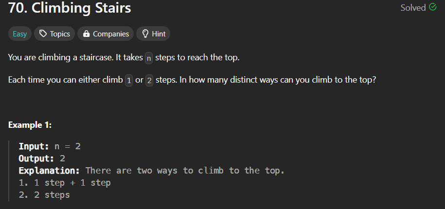

# Recursion-DP
DSA RECURSION PRACTIC + DP

--- 
# Print Reverse counting 
```cpp
void printRev(int n){
    // base case 
    if(n<=0)return;
    cout<<n<<" ";
    // call function 
    printRev(n-1);
}
int main(){
    printRev(5);
}
```
# Print for Counting
```cpp
void PrintFor(int n ){
    // base case
    if(n<=0)return;
    printFor(n-1);
    cout<<n<<" ";
}
int main(){
    printFor(5);
}
```
# Find The Fect
```cpp
int Fect(int n){
    if(n<=1)return 1;
    return n*fect(n-1);
}
int main(){
    int ans = fect(10);
    cout<<ans<<endl;
}
```

# Power Function
```cpp
int power(int x  , int n){
    if(n==0)return 1;
    return x*power(n-1);
}
int main(){
    cout<<power(2,5);
}
```
# Fibinocci Nth term
```cpp
int nthFeb(int n){
    if(n<=1)return n;
    return nthFib(n-1)+fib(n-2);
}
int main(){
    cout<<nthFib(9);
}
```
# Print array
```cpp
void PrintArr(int st , int arr[]){
    if(st>=arr.size())return;
    cout<<arr[st];
    PrintArr(st+1,arr);
}
int main(){
    int arr[5] = {2,4,3,2,2};
    PrintArr(0,arr);
       }
```
# Print Array Using pointer #important
```cpp
 void printArrayFor(int a[], int n){
    if(n<=0)return;
    cout<<a[0]<<" ";
    printArrayFor(a+1,n-1);
}
void printArrayBack(int a[],int n){
    if(n<=0)return;
    printArrayBack(a+1,n-1);
    cout<<a[0]<<" ";
}
int main(){
    int n = 10;
    int a[n] = {1,2,3,4,5,6,7,8,9,10};
    printArrayFor(a,n);
    cout<<endl;
    printArrayBack(a,n);
}
```
# Find Max In Array
```cpp
int findMax(int arr[],int n,int &mx){
  if(n==0)return mx;
  if(mx<arr[0])mx = arr[0];
  return findMax(arr+1 , n-1,mx);
}
int findMin(int arr[],int n,int &mn){
    if(n==0)return mn;
    if(mn>arr[0])mn = arr[0];
    return findMin(arr+1,n-1,mn);
}
int main(){
    int n = 10;
    int arr[n] = {12,2,32,4,5,16,7,8,9,10};
    findMax(arr,n,INT_MIN);
    findMin(arr,n,INT_MAX);
}
```
# Print all the digit
```cpp
void printAlldigit(int n){
    if(n==0)return;
    printAlldigit(n/10);
    cout<<n%10<<" ";
}
int main(){
    int n;
    cin>>n;
    printAlldigit(n);
}
```
# Check arr is sorted 
```cpp
bool cheakSorted(int arr[],int n , int st){
    if(st>=n-1)return true;
    if(arr[st]>arr[st+1])return false;
    cheakSorted(arr,n,st+1);
}
```
# Binary Search

```cpp
int BS(vector<int>& nums, int key, int st, int end) {
        if (st > end)
            return -1;
        int mid = (st + end) / 2;
        if (nums[mid] == key)
            return mid;
        else if (nums[mid] > key)
            return BS(nums, key, st, mid - 1);
        else
            return BS(nums, key, mid + 1, end);
    }

 int search(vector<int>& nums, int key) {
        return BS(nums, key, 0, nums.size() - 1);
    }
```
# Climb Stairs way

### Solve using Recursion
```cpp
  int climbStairs(int n) {
        if (n == 0 || n == 1)
            return 1;
        return climbStairs(n - 1) + climbStairs(n - 2);
    }
```
> it git TLE due to constant
### Solve using DP TOP DOWN 
```cpp
  int solve(int n, vector<int>& dp) {
        if (n == 0 || n == 1)
            return 1;
        if (dp[n] != -1)
            return dp[n];
        return dp[n] = solve(n - 1, dp) + solve(n - 2, dp);
    }
    int climbStairs(int n) {
        vector<int> dp(n + 1, -1);
        return solve(n, dp);
    }
```
### using dp concept Bottom up
```cpp
int climbStairs(int n) {
        vector<int> dp(n + 1, -1);
        
        dp[0] = dp[1] = 1;
        for (int i = 2; i <= n; i++)
            dp[i] = dp[i - 2] + dp[i - 1];
        return dp[n];
    }
```
### Space optimize 
```cpp
int climbStairs(int n) {
        int first = 1, second = 1, next = 1;
        for (int i = 2; i <= n; i++) {
            next = first + second;
            first = second;
            second = next;
        }
        return next;
    }
```
# min Cost to climbing stairs

### Recursion Code
```cpp
 int solve(int n, vector<int>& cost) {
        if (n == 0 || n == 1)
            return cost[n];
        return cost[n] + min(solve(n - 1, cost), solve(n - 2, cost));
    }
    int minCostClimbingStairs(vector<int>& cost) {
        int n = cost.size();
        return min(solve(n - 1, cost), solve(n - 2, cost));
    }
```
### TOP Down Approch DP
```cpp
 int solve(int n, vector<int>& cost, vector<int>& dp) {
        if (n == 0 || n == 1)
            return cost[n];
        if (dp[n] != -1)
            return dp[n];
        return dp[n] = cost[n] +
                       min(solve(n - 1, cost, dp), solve(n - 2, cost, dp));
    }
    int minCostClimbingStairs(vector<int>& cost) {
        int n = cost.size();
        vector<int> dp(n + 1, -1);
        return min(solve(n - 1, cost, dp), solve(n - 2, cost, dp));
    }
```
### Bottom Down Approch
```cpp
int minCostClimbingStairs(vector<int>& cost) {
        int n = cost.size();
        vector<int> dp(n + 1, -1);
        dp[0] = cost[0], dp[1] = cost[1];
        for (int i = 2; i < n; i++)
            dp[i] = cost[i] + min(dp[i - 1], dp[i - 2]);

        return min(dp[n - 1], dp[n - 2]);
    }
```
### Optimze approch 
```cpp
 int minCostClimbingStairs(vector<int>& cost) {
        int first = cost[0], second = cost[1];
        for (int i = 2; i < cost.size(); i++) {
            int next = cost[i] + min(first, second);
            first = second;
            second = next;
        }
        return min(first, second);
    }
```